# Tads3 Cartographer library

# version 0.7 - beta
[](./examples/screenshots/demo.gif)

**fig.1**

### What is it

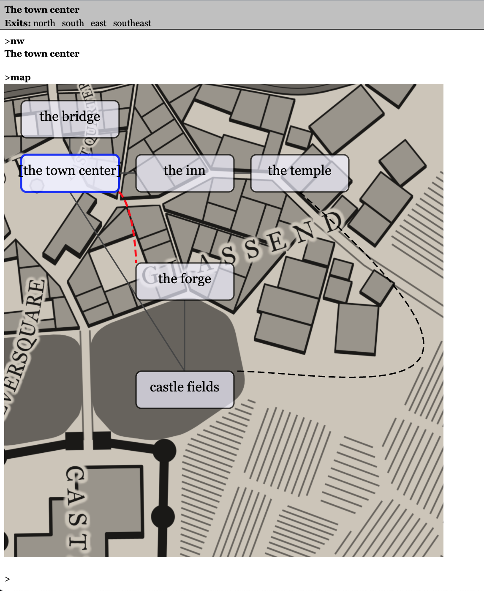

The Tads3 Cartographer library is tool that generates a map from your Tads3 source code that can be used either as an aid when developing your game or as an in-game map for the player. It supports various output formats. Depending on your solution and framework it can be a map in svg, html, dot-graphics or plain old ascii. 

At the bare minimum you just need to import it and supply a map command to get something to render on your screen or to a file in game directory.

In your Makefile add:
```
    -lib ../cartographer
    -source ../renderers/scaled-text-renderer
    -source ../renderers/svg-renderer
```

In your source code, add somewhere:

```
DefineIAction(Map)
    execAction(cmd) {
        
        // Figure out the room's coordinates based on their direction between each other 
        local roomCrawler = new RoomCrawler();
        local rooms = roomCrawler.crawl(gPlayerChar.location);
        
         
        // (Optionally)
        // Render and store an svg map to local file
        local tilemap = new SvgTileMap(roomCrawler.maxX, roomCrawler.maxY);
        tilemap.populate(rooms);
        local svgMapStr = tilemap.render();    
        saveStringToFile(svgMapStr, 'mapdata.svg');
        "Map generated to file mapdata.svg in current folder\n";
         
        // (Optionally)
        // Render and display an in-game ascii map
        local textMap = new ScaledTextTileMap(roomCrawler.maxX, roomCrawler.maxY);
        textMap.populate(rooms);
        "<<textMap.render()>>";
    }

;

```

for a minimum example implementation. Then you can fine tweak the rest (per room via optional properties that overrides the defaults). 

If you now compile your game and type "map" a file will be produced, like this:

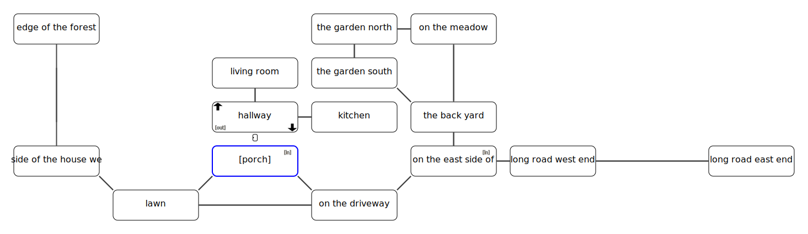

Fig.1


And in-game map like this: 
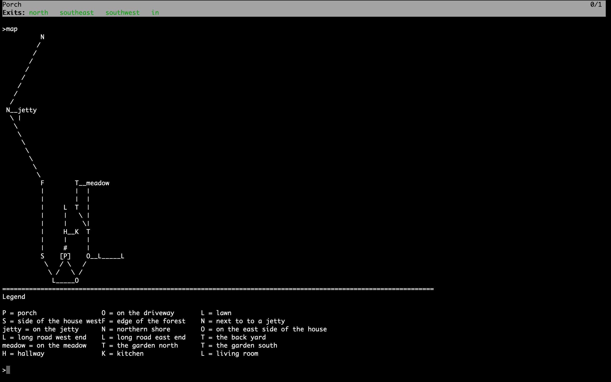

fig.2


(See example 1 for the code that produces the images above.)


*The SVG-renderer* (fig.1) can be suitable for a game running with the webgui while the *HTML renderer* might be more suitable for a game running locally with the HTML tads interpreter since it produces a table that could easily be rendered in QTads or similar HTML supportive interpreters.
I would though recommend the *WebUI* instead since it has more advantages in rendering details. 

If you want to stay true with the textformat (and perhaps get a mud revival feeling), you might want to use the two pure text-renderers which can output the map in text-format in any interpreter, including the text-only ones. 

The two choices here are to either go with the ScaledTextRenderer that displays connections and doors, where the output looks like this:

### ScaledTextRenderer

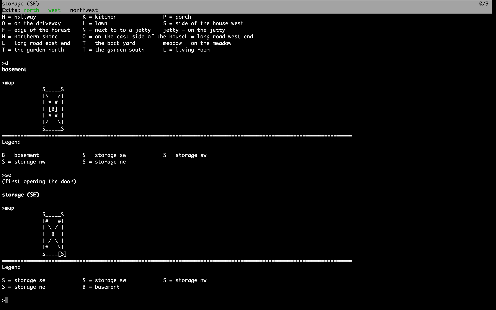
fig.3

Or go with the compact looking TextTileMap looking like fig.4

In adv3Lite there's also an exemplae on how to implement the map together with a menu (similar to the help menu), using the banner api to display the map (see example1 in examples directory) and navigate it with the WASD keys. (see fig.2)

### TextTileMap

```
Exits: north   southeast   in
============================================================
          Th        meadow
LR        Th
Ha        Ki        Th
*Po*                On        Lo                  Lo
          On
============================================================
Legend

Po = porch                              On = on the east side of
Lo = long road east end                 Th = the garden south
meadow = on the meadow                  Ha = hallway
Ki = kitchen                            LR = living room
La = landing                            Ba = bathroom
Be = bedroom
```
**fig.4**

-----------------------

### HTML renderer:
The HTML maps looks like this:  
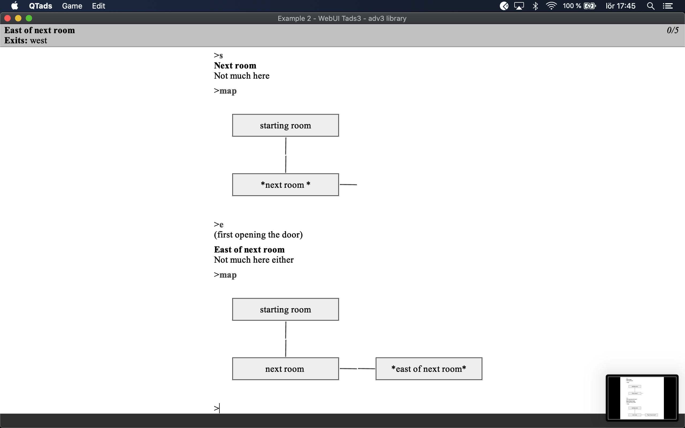

**fig.5**


### WebUI:
And the a very basic usage of the WebUI toghether with the svg-renderer, looks like this: 
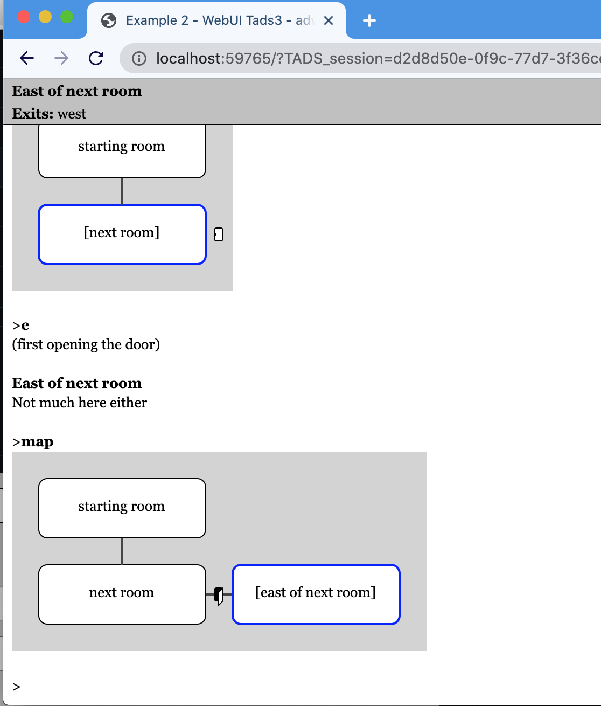

**fig.6**


# Basic instructions on how to use the library

## Using the RoomCrawler class

Before any rooms can be displayed you need to "crawl" them, which essentially means that the rooms will be iterated recursively from any starting point (preferably the player's location), and each and every room connected will be given a (x, y, z)  coordinate. 

The coordinate system has its origin in 0,0 and grows (eastward) in x-axis and  (southwise) in y-axis, e.g:

```
    0 1 2 3 
  +--------> x
0 |
1 |
2 |
  y

```

Not depicted here the z-axis goes up positive, and down negative

That means the coordinate {x:2,y:2,z:0} has its north neighbour room to in {x:2,y:1,z:0}, its southeast in {x:3,y:3,z:0} and its downward neighbour in {x:2,y:2,z:-1}.


The "crawling" is made with the following code:

```
    local roomCrawler = new RoomCrawler();
    local rooms = roomCrawler.crawl(gPlayerChar.location, true); 
```
The first parameter sets the starting point to crawl from, and the second boolean type parameter is a flag to use if you only want visited rooms to be crawled through. It is optional, so you can equally well type:

```
        local rooms = roomCrawler.crawl(gPlayerChar.location); 
```

## Select a renderer to output the map

Next up is to decide on a renderer. if you like to go with SVG, use SvgTileMap:
``` 
    local svgTileMap = new SvgTileMap(roomCrawler.maxX, roomCrawler.maxY);
```
This will render a complete svg formatted file to a string that you can do whatever you want with.

The two parameters where we use the values of roomCrawler.maxX, respectively roomCrawler.maxY is unit number that will be converted to pixels depending on width, height and padding settings in the SvgTileMap. The variables maxX and maxY here means to how many tiles x-wise and y-wise have been counted to during the crawling process. So when we create a tilemap we know how big that tilemap must be in order to make room for all rooms.)

Each tile's width and height have default values so you don't need to do anything to them but if you want to tweak them, that's easily done. You can either extend the constructor call with two additional parameters, 

``` 
    local svgTileMap = new SvgTileMap(roomCrawler.maxX, roomCrawler.maxY, 120, 80);
    svgTileMap.populate(rooms);

```

or just set them directly afterwards:
``` 
    local svgmap = new SvgTileMap(roomCrawler.maxX, roomCrawler.maxY);
    svgmap.tileWidth = 120
    svgmap.tileHeight = 80
```


If you like to go with HTML, instead of SvgTileMap, use HtmlTileMap:
``` 
    local htmlMap = new HtmlTileMap(roomCrawler.maxX,roomCrawler.maxY);
    htmlMap.populate(rooms);

```
HtmlTileMap hasn't yet received as much love as SvgTileMap, so it's less tweakable, but it isn't easily done anyway considering Tads only supports HTML 3.2 tables without styling, (but at least the borders are hidden.) 

The same could be said about the support for the graphviz dot, format which is acquired via the renderGraphvizDotMap function. It is still not fully functional, and very primitive done compared to the SvgTileMap.
``` 
    local dotMap = renderGraphvizDotMap(rooms);
``` 

The ScaledTextTileMap and TextTileMap renderer will render a textbased map as seen in fig.3 and fig.4:
``` 
    local map = new TextTileMap(roomCrawler.maxX,roomCrawler.maxY);
    map.populate(rooms);

``` 
The TextTileMap is very simple and doesn't show any room connnections. It is more compact than the ScalableTextTileMap though.

``` 
    local map = new ScalableTextTileMap(roomCrawler.maxX,roomCrawler.maxY);
    map.populate(rooms);
``` 

The scalableTextTileMap is showing connections between each room and doors.

when you are done rendering with either choice of renderer, you can either display it directly to the screen or save it to a file for external viewing.

``` 
saveStringToFile(dotMap, 'mapdata.gv');
saveStringToFile(htmlMap, 'mapdata.html');
saveStringToFile(svgTileMap, 'svgmap.gv');
``` 
See example1 in examples for a complete example. 


## keeping the result of a crawl and using renderPredicates (SvgTileMap)

To be bit more efficient about the rendering of the rooms, it can be a good idea to crawl all the rooms first, store the result in a list, create a tilemap with that result and just re-render that map instead of redoing the whole procedure each time. However if the roomCrawler should visit all rooms no matter if they have been visited or not, then the tilemap will have to take over that responsibility.

SvgTileMap.renderPredicates therefore holds a list (empty as default) of predicates that can be set to condition what rooms (and its outgoing paths) should be rendered or not. 

A convenient predicate to display only visited rooms is statically declared inside the SvgTileMap called "SvgTileMap.renderOnlyVisitedRooms" , which itself is equivalent to: "{room: libGlobal.playerChar.hasSeen(room)}"

To add it just type:
```
svgTileMap.renderPredicates = [SvgTileMap.renderOnlyVisitedRooms];
```


One solution to keep the crawling result could look like the following:

```
mapManager: object
    roomCrawler = nil 
    rooms = nil
    svgTileMap = nil
    
    initMap() {
        roomCrawler = new RoomCrawler();
        rooms = roomCrawler.crawl(gPlayerChar.location); 
        svgTileMap = new SvgTileMap(roomCrawler.maxX, roomCrawler.maxY, 70, 50);
        svgTileMap.renderPredicates = [SvgTileMap.renderOnlyVisitedRooms];
        svgTileMap.populate(rooms);
    }
    drawMap() {
        "<<svgTileMap.render()>>";
    }
;

```

Now you can just call mapManager.initMap() at the beginning of the game, and then call drawMap() each time you want to render it.


## Handling more complex maps

In a perfect world the alignments of the rooms would always be perfect and the game mapping engine would of course figure out exactly how you intended things in your imagination to end up on the screen, right? The cartographer library cannot draw many such conclusions (yet). Rather it assumes that you won't put rooms next to each other and still make them go cross each other. 

However in order to overcome this restriction, there are a few tools at your disposal. One is **the map distance length table** (mapDistanceLengthTable) which is set per room basis if needed.  Another is **map regions** (an array of arrays being setup in RoomCrawler.setupMapRegions if needed)

If you want almost full control there's also:
    **overrideMapCellProperties**,
    **pathConnectionTable**,
    **mapCoordsOverride**,
    **mapConnectionShape**,
    **svgGfx**,
    and **overrideMapCellConstruction**
    
(All set per room basis).
 
## overrideMapCellProperties

The **overrideMapCellProperties** is a LookupTable which supports the following properties for the SVG-renderer, letting you override width, height, and the x/y-offset of the tile per pixel value:

```
overrideMapCellProperties = [ 
    'shape'->'ellipse',
    'width' -> 80, 
    'height' -> 120, 
    'offsetX' -> 20,
    'offsetY' -> 20 
]
```
This is helpful if wanting to depict room shapes of different sizes.


## mapConnectionShape

mapConnectionShape is a hook that lets you override how the connections between the tiles appears on the screen. The default behaviour is to draw a simple line from x1,y1 to x2,y2 where the first group of coordinates (x1,y1) is the default origin for the particular edge in question. e.g a north exit will be in the middle of the upper part of the tile, and a southeast will be at the bottom right corner of the tile. The second group (x2,y2) is the equivalent for the connecting room.

Therefore the default behavour is the equivalent of overriding the mapConnectionShape on a room like this:

```
exampleRoom: Room
    mapConnectionShape(edges, cell, adjacentCell, exitProp, adjacentRoomExitProp) {
        return createLine(edges[1], edges[2], edges[3], edges[4]);
    }
;
```
Where the createLine is simply a helper method (that  also applies a current theme to the attributes and style of the line if none is provided as optional arguments) for creating a svg line element.

You could equally well type:

```
exampleRoom: Room
    mapConnectionShape(edges, cell, adjacentCell, exitProp, adjacentRoomExitProp) {
        return '<line x1 = "<<edges[1]>>" y1 = "<<edges[2]>>" x2 = "<<edges[3]>>" y2 = "<<edges[4]>>"';
    }
;
```

the parameters **edges** is an array containing four values, namely x1,y1 and x2,y2. 

The **cell** contains information about the current cell. Among its properties is the valuable roomRef reference that lets us tap into the room properties itself.

the **adjacentCell** is a the adjacent cell's equivalent for ´**cell**´.

the **exitProp** shows what exit from the cell this path leaves from. And **adjacentRoomExitProp** is where the equivalent of **exitProp** for the **adjacentCell**.

mapConnectionShape therefore gives us full control in how we want to connect and shape our connections, for example if we like to create a bezier curve with an animated dashed line between a specific connection and its connecting room, we could override mapConnectionShape like this:

```
exampleRoom: Room
    mapConnectionShape(e, cell, adjacentCell, exitProp, adjacentRoomExitProp) {

        // If the northwest direction, draw an animated path:
        
        if(exitProp==&northwest) {
                return '<path d="M <<e[1]>> <<e[2]>> 
                             C <<e[1]-40>> <<e[2]-40>>, 
                               <<e[3]-80>> <<e[4]+75>>, 
                               <<e[3]-80>> <<e[4]+25>>" 
                    marker-end="url(#redArrow)"
                    fill="none"
                    stroke-dasharray="10 5"
                    style="stroke:red; stroke-width:2;">
                        <animate attributeName="stroke-dashoffset" values="15;0" dur="5s" repeatCount="indefinite" />
                    </path>';
        }
        // And for all other directions, draw a regular line:
        return createLine(e[1], e[2], e[3], e[4]);
    }
```
(See example 3 for a demonstration of the code above.)

Note: mapConnectionShape always expects a string value as return value.


## svgGfx

**svgGfx** Let's us tap into the specific coordinates of a cell to draw some extra cell graphics if wanted.
It has four parameters, x,y, width and height which gives us the cells's current position and form values:

Example usage:

```
room: Room
    svgGfx(x,y,w,h) {
        return '<draw some fun svg stuff here />';
    }
;
```

## overrideMapCellConstruction

In case the shapes available in how the room should be depicted by default isn't satifying enough, you can override the cell construction itself via overrideMapCellConstruction method hook per room.

Example usage: 

```
room: Room
    overrideMapCellConstruction(cell, name, x, y, width, height, isPlayerTile)
        local s = new StringBuffer();
        local style = isPlayerTile? gMapThemes.getPlayerRectStyle() : nil;
        local cellCenterX = x+cell.getWidth()/2;
        local cellCenterY = y+(cell.getHeight()/2) + 3;
        s.append(createRect(x,y,  width, height, style, attributes));
        s.append(createMiddleCentedText(cellCenterX,cellCenterY, name));
        return s;
    }
;
```
This example just creates the default rectangle. But go crazy here if you like.


## mapDistanceLengthTable
The mapDistanceLengthTable is a LookupTable that will connect a direction from the room with a number of specified tiles away from it. (If the mapDistanceLengthTable is not defined the assumption of one tile will be drawn). But if it is there and say connecting the &north direction with 2 tiles in length, the room that connects with it using that direction will be drawn two tiles north. Make sure though to mirror this in the north room, otherwise it will be drawn with a gap when standing north of it, and only look good when standing south of it. So in the opposite room, add a mapDistanceLengthTable = [ &south -> 2 ]. 

Like in this example: 

``` 
backyard: Room 'The back yard'
    south = sideofhouse
    north = meadow   
    northwest = gardenAreaSouth

    // Mirroring meadow's mapDistanceLengthTable
    mapDistanceLengthTable = [ &north -> 2 ]
;

meadow: Room 'On the meadow'
    mapName = 'meadow'
    south = backyard
    west = gardenAreaNorth

    // Mirroring backyard's mapDistanceLengthTable
    mapDistanceLengthTable = [ &south -> 2 ] 
;
```

So now instead of having this:

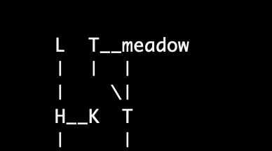

**fig.7**

You can have the following:


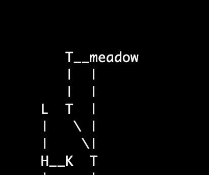


**fig.8**

It works in all directions with any distance set.

Take note: when using the mapDistanceLengthTable numbers are always positive. It doesn't matter if the direction is north or south, east or west. When you use the mapCoordsOverride (described further ahead) numbers will be set as an offset in the cartesian space. Which means that if expressing something north of a room, it will be negative. And south of a room positive. Vice versa for east(1) and west(-1). More on mapCoordsOverride later.


## Map regions
Another tool in the toolbox are map regions. The concept of map regions is that it will only render regions where the player is currently at. Example of usage: 
```

roomCrawler.setupMapRegions([
    [porch, driveway, sideofhouse, backyard, gardenAreaNorth, gardenAreaSouth, meadow],
    [hallway, livingroom, kitchen],
    [landing, upperbathroom, bedroom]
]);
``` 
Say for example that the player is within the first region, in the 'backyard'. This will cause the only rooms to render on the screen to be: "porch, driveway, sideofhouse, backyard, gardenAreaNorth, gardenAreaSouth, meadow" and all the other rooms will be omitted. That is until the player enters another region. 
As things stand right now, if there's a room that's outside all of the specified rooms ALL rooms will be rendered when standing in that tile. This might change in the future.

Also, concering rooms that are not on the same level, they will not be rendered together. Instead you will see an entirely new map. (Compare fig.2 and fig.3)

If there's a location connected with an 'in' direction, that room will also be rendered in isolation. 


## pathConnectionTable
The idea of the pathConnectionTable is to provide an override hook for each room's connection to another room. Sometimes we don't want the line connection the rooms to be mirrored in a north <-> south manner, but rather want for instance the north exit from a room connect to the east exit on the adjacent room. The default locations where these connections attaches on each tile might cause us pathways that looks like they do in fig.9:

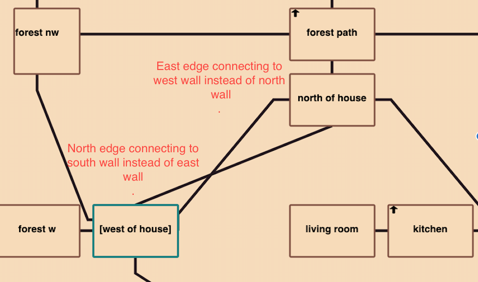

**fig.9**

We can change the defaults by specifying a pathConnectionTable with the tilemap edges we wish to associate with each other for this specific room, e.g: 

```
pathConnectionTable = [&north -> &east,  &south -> &east]
```

In the above example the north edge of the cell will be the starting point of the line and it will connect to the east part of the room connected specified with the "north" property. 

Compare here to where both location "north of house" and "west of house" has had their exits remappped to align with each other.
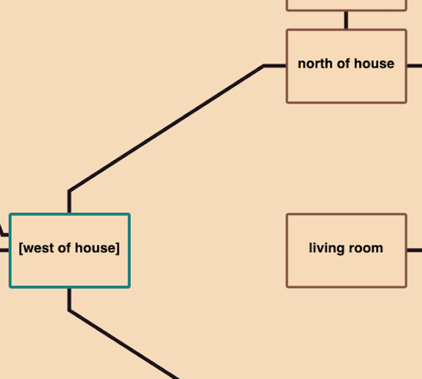

**fig.10**

## mapCoordsOverride

Use mapCoordsOverride when you want to achieve a layout with more varying distances than can be achieved with mapDistanceLengthTable. It gives you the power to explicitly say for instance I want the northern exit to be placed -2 tiles from current room y-wise, and +5 tiles x-wise. 

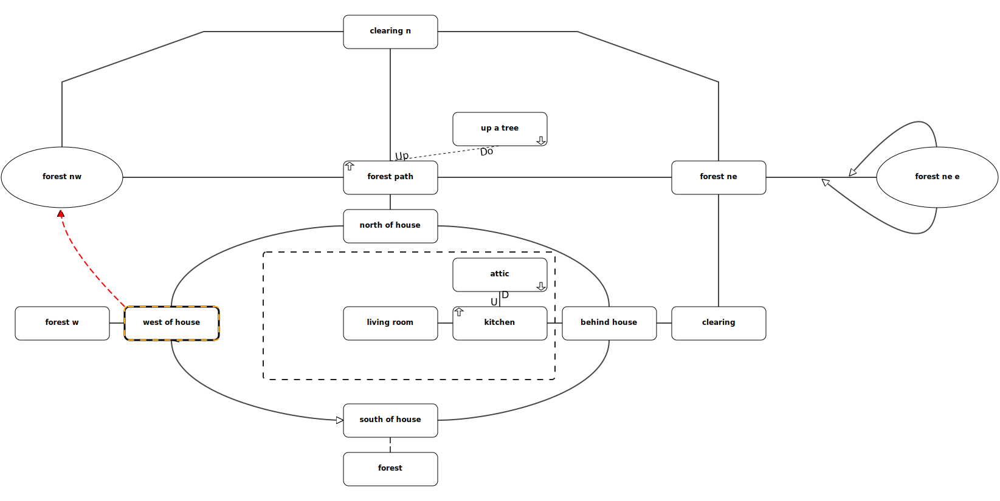

**fig.11**


The table consist of a direction property as key and an array of three integers (x,y,z). This will let you override how each direction will be traversed from one room to another during the mapping process.

Take for example: 
```
room1: Room 'room'
    mapCoordsOverride = [ &north->[-2, -1,0] ]     // x,y,z
    north = room2
;
``` 
When "crawling" this room's exits, and a mapCoordsOverride table is detected for the "north" direction, that value will be used instead of the default direction (of [0,-1,0]).

(Notice You'll have to think units here, and not pixels. Each room is having a unique position plotted against a tilemap in the background so if "room1" had the position of x=2 and y=2, now the north direction will be translated to:  x = 2 - 2 = **0** and y = 2 -1 = **1**. This means in practice that the distance will be increased by one tile between the rooms.

Be careful here though. Since you may not know which route the map will traversed during the "crawling" of the map pay extra attentention to always follow the mirroring principle.

***The mirroring principle*** in this case means that for each mapCoordsOverride (and also pathConnectionTable) we do for a direction, we must be careful doing the opposite room's mirrored translation back to this room. Meaning that in the above case room2 should be defined as:

 ```
room2: Room 'room'
    mapCoordsOverride = [ &south->[2, 1,0] ]     // x,y,z
    south = room1
;
``` 

Some convenience macros is here allow you to write: the arrays with macros instead:

mapCoordsNWBy(3) is the same as [-3,-3,0]
mapCoordsNEBy(2) is the same as [2,-2,0]

These work for the most compass directions (N,S,E,W,NE,NW,SE,SW)
So if we just want a 45 degrees diagonal distance it can look like this:

```
room: Room 'room'
    mapCoordsOverride = [ &north->mapCoordsNWBy(3), &west->mapCoordsWBy(3), &south->mapCoordsSBy(3) ]
;
``` 

See example3 for a complete example on how to achieve the Zork map above. (Be warned though, that it's both tedious and error prone to do a map like this and my advice is to stay away from it. But it's at least good to know that it is possible)

A little help while creating a map like this is to set the showGrid property of svgTileMap to true (which is default nil).

```
svgTileMap.showGrid = true;
````
This will make a half visible grid appear on the map. Which makes it easy to count the tiles between each other.


----


Another example of how to make the map work together with an image background and using bezier curves for paths can be found in example 5. That example also show's how to setup map regions and shift the background image when entering a new region.


**fig.12**


## Themes

gMapThemes is a global object holding a bunch of lookup tables that holds the default look and feel. It let's you change the appearance of the SVG map in an instance by switching between a theme name value. At the moment four themes are supported: 'default', 'darkmode', 'bright' and 'zork'. The last two are temporary experimentations, and will doubtfully be part of the 1.0 release. I therefore encourage you to create your own theme or sticking with either 'default' or 'darkmode'.

All you need to do to set a theme is following before rendering the map:

```
gMapThemes.currentTheme = 'default';
```


# Examples

* See examples/example1 for an example on how a minimal setup could look like with adv3lite library

* See examples/example2 for a demonstration of the different renderer options using the adv3 library.

* See examples/example3 for a demonstration on how to create a complex map like the one in Zork.

* See examples/example4 for an demonstration on how to create a HTML map

* See examples/example5 for an demonstration on how to create an webui game using the svg renderer


### Modules

If you care about kilobytes in your compiled version (and I think you should :) or simply just don't want to use anything else besides a partical module, just exclude it. This is documented in the system manual, but I've added it here for your benefit.

To exclude a specific module that you are not using, just add -x <path of the module> in your Makefile.t3m (or on the command line prompt), e.g:

instead of just typing: 
```
    "-lib ../cartographer-all"
```
to include the whole library with all renderers, type: 
```
    -lib ../cartohrapher-all -x renderers/scaled-text-renderer -x renderers/dot-renderer
```
that will in this case remove the scaled-text-renderer and dot-renderer from compilation. 


**Or more easily you can just use the minimal library definition** 
```
    -lib ../cartographer
```
And instead add each renderer separately.
```
    -source ../renderers/scaled-text-renderer
    -source ../renderers/svg-renderer
```


## License

The cartographer library is released as freeware, Creative Commons Zero v1.0 Universal.


## Disclaimer

This is a work in progress and there's a lot of ways you could tweak this to bits and pieces so I encourage to go by the defaults as much as possible at this stage. Even so I would be grateful for any bug reports or feature requests. If you would like to chip in on the library itself. Just clone it and create a PR. 

The Graphviz dot map is right now a bit in experimental mode. It doesn't always line up the rooms correctly. It's merely added as an example. The same could be said about the HTML renderer.

---

Copyright 2021-2021 Tomas Öberg
